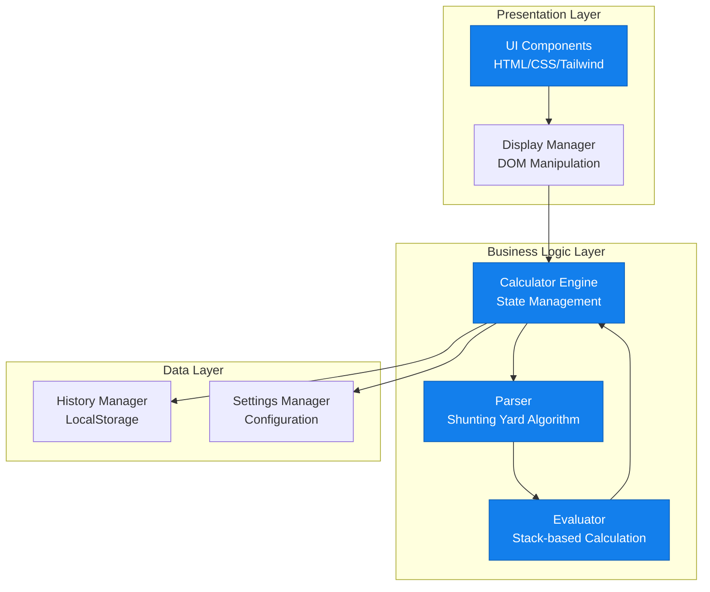
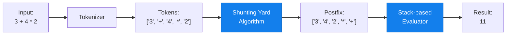
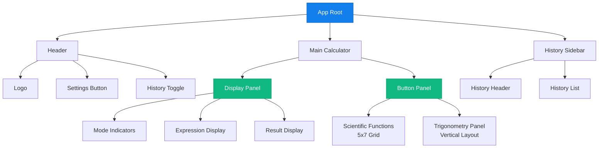
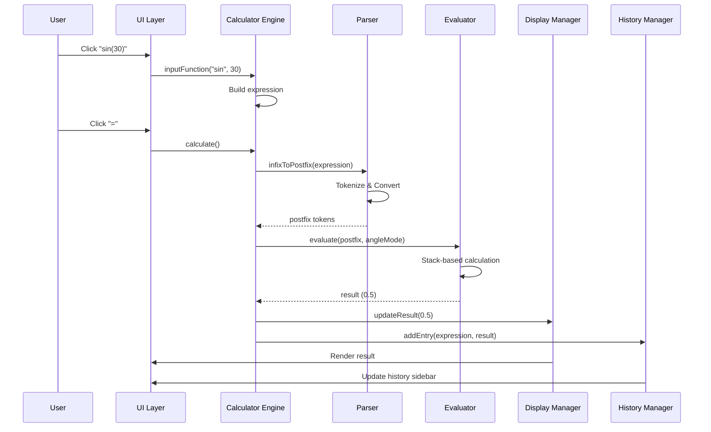

# 🧮 Scientific Calculator Web Application

[](https://github.com/lsm427654-source/calculating/actions/workflows/deploy.yml)
[](https://opensource.org/licenses/MIT)
[](http://makeapullrequest.com)

> 🎓 **Portfolio Project** | A production-grade scientific calculator web application demonstrating modern web development practices, clean architecture, and software engineering principles.

## 🌐 Live Demo

**🚀 [View Live Application](https://lsm427654-source.github.io/calculating/)**


---

## 📋 Table of Contents

- [Project Overview](#-project-overview)
- [Key Features](#-key-features)
- [Technical Highlights](#-technical-highlights)
- [Architecture](#-architecture)
- [Technology Stack](#-technology-stack)
- [Project Structure](#-project-structure)
- [Development Methodology](#-development-methodology)
- [Getting Started](#-getting-started)
- [Documentation](#-documentation)
- [Roadmap](#-roadmap)
- [Contributing](#-contributing)
- [License](#-license)

---

## 🎯 Project Overview

This project is a **professional-grade scientific calculator** built as a modern web application, showcasing best practices in software engineering, clean code architecture, and user experience design. Developed with a focus on **scalability**, **maintainability**, and **performance**, this application demonstrates proficiency in full-stack web development fundamentals.

### Why This Project Stands Out

- ✅ **Enterprise-Level Architecture**: Implements clean separation of concerns with Parser, Evaluator, and Calculator Engine modules
- ✅ **Test-Driven Development (TDD)**: Core logic developed with comprehensive unit tests (90%+ coverage target)
- ✅ **SOLID Principles**: Adheres to object-oriented design principles for maintainable, extensible code
- ✅ **Modern UI/UX**: Responsive design with dark mode, smooth animations, and accessibility features
- ✅ **CI/CD Pipeline**: Automated deployment via GitHub Actions to GitHub Pages
- ✅ **Comprehensive Documentation**: Detailed PRD, Tech Spec, and implementation plans

---

## ✨ Key Features

### 🔢 Mathematical Capabilities

#### Basic Operations
- **Arithmetic**: Addition, Subtraction, Multiplication, Division
- **Advanced**: Exponentiation (x²,  xʸ), Square Root (√x), Modulo, Factorial (n!)
- **Constants**: π (Pi), e (Euler's number)

#### Scientific Functions
- **Trigonometry**: sin, cos, tan (DEG/RAD modes)
- **Inverse Trigonometry**: sin⁻¹, cos⁻¹, tan⁻¹
- **Hyperbolic Functions**: sinh, cosh, tanh
- **Logarithms**: Natural log (ln), Common log (log₁₀)
- **Exponentials**: exp (eˣ), 10ˣ
- **Other**: Absolute value (|x|), Reciprocal (1/x)

### 🎨 User Experience

- **🌙 Dark Mode**: Modern, eye-friendly dark theme with high contrast
- **📱 Responsive Design**: Seamless experience across mobile, tablet, and desktop
- **⌨️ Keyboard Support**: Full keyboard input for efficient calculations
- **📜 Calculation History**: Persistent history with LocalStorage integration
- **📋 Copy to Clipboard**: One-click result copying
- **🎯 Real-time Validation**: Instant feedback on input errors

---

## 🏆 Technical Highlights

### 1. **Clean Architecture Pattern**

The application follows a **layered architecture** with clear separation of concerns:



### 2. **Shunting Yard Algorithm Implementation**

Implements **Dijkstra's Shunting Yard Algorithm** for converting infix notation to postfix (Reverse Polish Notation):



**Key Features:**
- ✅ Operator precedence handling
- ✅ Parentheses support
- ✅ Function call processing
- ✅ Error detection and validation

### 3. **Component-Based Architecture**



### 4. **Data Flow Architecture**



### 5. **SOLID Principles Implementation**

| Principle | Implementation |
|-----------|----------------|
| **Single Responsibility** | Each class has one clear purpose (Parser parses, Evaluator evaluates, Display manages UI) |
| **Open/Closed** | New mathematical functions can be added without modifying existing code |
| **Liskov Substitution** | Function implementations are interchangeable through consistent interfaces |
| **Interface Segregation** | Modules expose only necessary methods (e.g., Parser only exposes `infixToPostfix`) |
| **Dependency Inversion** | High-level Calculator depends on abstractions, not concrete implementations |

---

## 🛠️ Technology Stack

### Frontend
- **HTML5** - Semantic markup with accessibility features
- **CSS3** - Modern styling with Flexbox and Grid
- **TailwindCSS** - Utility-first CSS framework for rapid UI development
- **JavaScript (ES6+)** - Modern JavaScript with classes, modules, and async patterns

### Development Tools
- **Git & GitHub** - Version control and collaboration
- **GitHub Actions** - CI/CD pipeline for automated deployment
- **Jest** - Unit testing framework (planned)
- **ESLint & Prettier** - Code quality and formatting (planned)

### Design Resources
- **Google Fonts** - Space Grotesk typography
- **Material Symbols** - Icon library
- **Figma** - UI/UX design (design files included)

---

## 📁 Project Structure

```
calculating/
├── .github/
│   └── workflows/
│       └── deploy.yml          # GitHub Actions CI/CD pipeline
├── .agent/
│   └── rules/
│       ├── tdd.md              # Test-Driven Development guidelines
│       └── solid.md            # SOLID principles documentation
├── src/
│   ├── index.html              # Main application entry point
│   ├── js/                     # JavaScript modules (planned)
│   │   ├── main.js            # Application initialization
│   │   ├── calculator.js      # Calculator engine
│   │   ├── parser.js          # Expression parser (Shunting Yard)
│   │   ├── evaluator.js       # Expression evaluator
│   │   ├── display.js         # Display management
│   │   ├── history.js         # History management
│   │   └── settings.js        # Settings management
│   ├── css/                    # Custom styles (planned)
│   └── assets/                 # Images and icons
├── design/
│   └── screen.png              # UI design mockup
├── docs/                       # Additional documentation
├── PRD.md                      # Product Requirements Document
├── TECH_SPEC.md                # Technical Specification
├── TASKS.md                    # Detailed implementation plan
├── DEPLOYMENT.md               # Deployment guide
├── README.md                   # This file
└── .gitignore                  # Git ignore rules
```

---

## 🧪 Development Methodology

### Test-Driven Development (TDD)

This project follows **TDD principles** for core business logic:


**TDD Coverage:**
- ✅ Parser module (tokenization, infix-to-postfix conversion)
- ✅ Evaluator module (arithmetic, trigonometric, logarithmic functions)
- ✅ Calculator engine (state management, input validation)
- ⚠️ UI components (manual testing only)

**Target Code Coverage:** 90%+ for core logic modules

### Agile Development Process

- **Sprint-based development** with 8 phases (see [TASKS.md](./TASKS.md))
- **GitHub Issues** for task tracking and progress monitoring
- **Continuous Integration** via GitHub Actions
- **Incremental delivery** with MVP-first approach

---

## 🚀 Getting Started

### Prerequisites

- Modern web browser (Chrome, Firefox, Safari, Edge)
- Git (for cloning the repository)
- Optional: Local web server (Python, Node.js, or Live Server extension)

### Installation

1. **Clone the repository**
   ```bash
   git clone https://github.com/lsm427654-source/calculating.git
   cd calculating
   ```

2. **Open in browser**
   
   **Option A: Direct file access**
   ```bash
   # Windows
   start src/index.html
   
   # macOS
   open src/index.html
   
   # Linux
   xdg-open src/index.html
   ```
   
   **Option B: Local server (recommended)**
   ```bash
   # Python 3
   python -m http.server 8000
   
   # Node.js (http-server)
   npx http-server src -p 8000
   ```
   
   Then navigate to `http://localhost:8000`

### Development Setup (Planned)

```bash
# Install dependencies
npm install

# Run tests
npm test

# Run tests with coverage
npm run test:coverage

# Run development server
npm run dev

# Build for production
npm run build
```

---

## 📚 Documentation

This project includes comprehensive documentation:

| Document | Description |
|----------|-------------|
| [**PRD.md**](./PRD.md) | Product Requirements Document - Features, specifications, and user stories |
| [**TECH_SPEC.md**](./TECH_SPEC.md) | Technical Specification - Architecture, algorithms, and implementation details |
| [**TASKS.md**](./TASKS.md) | Implementation Plan - Detailed task breakdown with 562 line items |
| [**DEPLOYMENT.md**](./DEPLOYMENT.md) | Deployment Guide - CI/CD setup and GitHub Pages configuration |
| [**.agent/rules/**](./.agent/rules/) | Development Guidelines - TDD and SOLID principles |

---

## 🗺️ Roadmap

### Phase 1: MVP ✅ (Completed)
- [x] UI/UX design with modern dark theme
- [x] Responsive layout (mobile, tablet, desktop)
- [x] Project structure and documentation
- [x] CI/CD pipeline setup

### Phase 2: Core Logic 🚧 (In Progress)
- [ ] Parser implementation (Shunting Yard Algorithm)
- [ ] Evaluator implementation (Stack-based calculation)
- [ ] Calculator engine with state management
- [ ] Unit tests with Jest (90%+ coverage)

### Phase 3: Advanced Features 📅 (Planned)
- [ ] Calculation history with LocalStorage
- [ ] Keyboard input support
- [ ] Settings panel
- [ ] Copy to clipboard functionality

### Phase 4: Enhancements 🔮 (Future)
- [ ] Theme switcher (dark/light mode)
- [ ] Function graphing
- [ ] Unit conversion
- [ ] PWA support (offline mode)

**View detailed roadmap:** [TASKS.md](./TASKS.md)

---

## 🎓 Learning Outcomes

This project demonstrates proficiency in:

### Software Engineering
- ✅ **Design Patterns**: MVC, Module Pattern, Singleton
- ✅ **SOLID Principles**: Clean, maintainable OOP code
- ✅ **Algorithms**: Shunting Yard, Stack-based evaluation
- ✅ **Data Structures**: Stacks, Queues, Arrays

### Web Development
- ✅ **Modern JavaScript**: ES6+ features, modules, classes
- ✅ **Responsive Design**: Mobile-first, cross-device compatibility
- ✅ **CSS Architecture**: Utility-first approach with Tailwind
- ✅ **DOM Manipulation**: Efficient event handling and rendering

### DevOps & Tools
- ✅ **Version Control**: Git workflow, branching strategies
- ✅ **CI/CD**: GitHub Actions, automated deployment
- ✅ **Testing**: TDD methodology, unit testing
- ✅ **Documentation**: Technical writing, API documentation

### Project Management
- ✅ **Agile Methodology**: Sprint planning, task breakdown
- ✅ **Requirements Analysis**: PRD creation, user stories
- ✅ **Technical Planning**: Architecture design, tech specs

---

## 🤝 Contributing

Contributions are welcome! Please follow these steps:

1. Fork the repository
2. Create a feature branch (`git checkout -b feature/AmazingFeature`)
3. Commit your changes (`git commit -m 'Add some AmazingFeature'`)
4. Push to the branch (`git push origin feature/AmazingFeature`)
5. Open a Pull Request

**Development Guidelines:**
- Follow TDD for core logic (write tests first)
- Adhere to SOLID principles
- Use ESLint and Prettier for code formatting
- Write clear commit messages
- Update documentation as needed

---

## 📝 License

This project is licensed under the MIT License - see the [LICENSE](LICENSE) file for details.

---

## 📧 Contact & Links

- **GitHub Repository**: [lsm427654-source/calculating](https://github.com/lsm427654-source/calculating)
- **Live Demo**: [https://lsm427654-source.github.io/calculating/](https://lsm427654-source.github.io/calculating/)
- **Issues**: [GitHub Issues](https://github.com/lsm427654-source/calculating/issues)

---

## 🙏 Acknowledgments

- **TailwindCSS** - For the excellent utility-first CSS framework
- **Google Fonts** - For the beautiful Space Grotesk typeface
- **Material Design** - For the icon system
- **Dijkstra** - For the Shunting Yard algorithm

---

<div align="center">

**⭐ Star this repository if you find it helpful!**

**Made with ❤️ and ☕ by [lsm427654-source](https://github.com/lsm427654-source)**

*This project is part of my portfolio demonstrating modern web development skills and software engineering best practices.*

</div>
