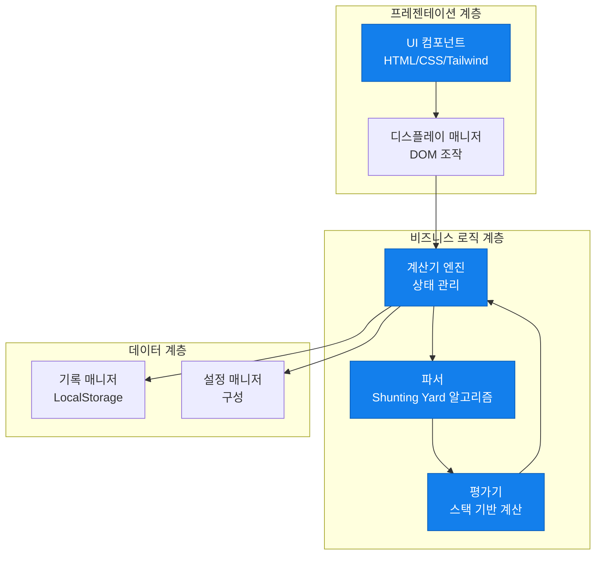
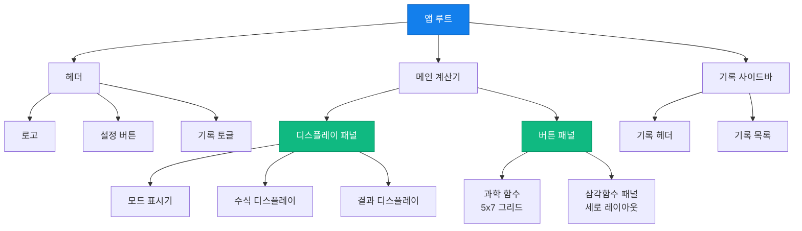
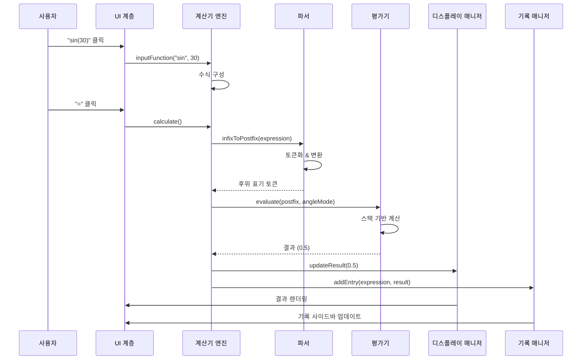

# 🧮 과학 계산기 웹 애플리케이션

[](https://github.com/lsm427654-source/calculating/actions/workflows/deploy.yml)
[](https://opensource.org/licenses/MIT)
[](http://makeapullrequest.com)

> 🎓 **포트폴리오 프로젝트** | 현대적인 웹 개발 관행, 클린 아키텍처, 소프트웨어 엔지니어링 원칙을 보여주는 프로덕션급 과학 계산기 웹 애플리케이션입니다.

## 🌐 라이브 데모

**🚀 [라이브 애플리케이션 보기](https://lsm427654-source.github.io/calculating/)**


---

## 📋 목차

- [프로젝트 개요](#-프로젝트-개요)
- [주요 기능](#-주요-기능)
- [기술적 특징](#-기술적-특징)
- [아키텍처](#-아키텍처)
- [기술 스택](#️-기술-스택)
- [프로젝트 구조](#-프로젝트-구조)
- [개발 방법론](#-개발-방법론)
- [시작하기](#-시작하기)
- [문서](#-문서)
- [로드맵](#️-로드맵)
- [기여하기](#-기여하기)
- [라이선스](#-라이선스)

---

## 🎯 프로젝트 개요

이 프로젝트는 **전문가급 과학 계산기**로, 소프트웨어 엔지니어링의 모범 사례, 클린 코드 아키텍처, 사용자 경험 디자인을 보여주는 현대적인 웹 애플리케이션입니다. **확장성**, **유지보수성**, **성능**에 중점을 두고 개발되었으며, 풀스택 웹 개발 기초에 대한 숙련도를 보여줍니다.

### 이 프로젝트의 차별점

- ✅ **엔터프라이즈급 아키텍처**: Parser, Evaluator, Calculator Engine 모듈을 통한 명확한 관심사 분리 구현
- ✅ **테스트 주도 개발(TDD)**: 포괄적인 단위 테스트로 개발된 핵심 로직 (90%+ 커버리지 목표)
- ✅ **SOLID 원칙**: 유지보수 가능하고 확장 가능한 코드를 위한 객체지향 설계 원칙 준수
- ✅ **현대적인 UI/UX**: 다크 모드, 부드러운 애니메이션, 접근성 기능을 갖춘 반응형 디자인
- ✅ **CI/CD 파이프라인**: GitHub Actions를 통한 GitHub Pages 자동 배포
- ✅ **포괄적인 문서화**: 상세한 PRD, 기술 사양, 구현 계획

---

## ✨ 주요 기능

### 🔢 수학적 기능

#### 기본 연산
- **산술 연산**: 덧셈, 뺄셈, 곱셈, 나눗셈
- **고급 연산**: 거듭제곱 (x², xʸ), 제곱근 (√x), 나머지, 팩토리얼 (n!)
- **상수**: π (파이), e (오일러 수)

#### 과학 함수
- **삼각함수**: sin, cos, tan (DEG/RAD 모드)
- **역삼각함수**: sin⁻¹, cos⁻¹, tan⁻¹
- **쌍곡선 함수**: sinh, cosh, tanh
- **로그**: 자연로그 (ln), 상용로그 (log₁₀)
- **지수**: exp (eˣ), 10ˣ
- **기타**: 절댓값 (|x|), 역수 (1/x)

### 🎨 사용자 경험

- **🌙 다크 모드**: 높은 대비의 현대적이고 눈에 편안한 다크 테마
- **📱 반응형 디자인**: 모바일, 태블릿, 데스크톱에서 원활한 경험
- **⌨️ 키보드 지원**: 효율적인 계산을 위한 전체 키보드 입력
- **📜 계산 기록**: LocalStorage 통합을 통한 영구 기록
- **📋 클립보드 복사**: 원클릭 결과 복사
- **🎯 실시간 검증**: 입력 오류에 대한 즉각적인 피드백

---

## 🏆 기술적 특징

### 1. **클린 아키텍처 패턴**

애플리케이션은 명확한 관심사 분리를 통한 **계층화된 아키텍처**를 따릅니다:



### 2. **Shunting Yard 알고리즘 구현**

중위 표기법을 후위 표기법(역 폴란드 표기법)으로 변환하기 위한 **Dijkstra의 Shunting Yard 알고리즘** 구현:


**주요 특징:**
- ✅ 연산자 우선순위 처리
- ✅ 괄호 지원
- ✅ 함수 호출 처리
- ✅ 오류 감지 및 검증

### 3. **컴포넌트 기반 아키텍처**



### 4. **데이터 흐름 아키텍처**



### 5. **SOLID 원칙 구현**

| 원칙 | 구현 |
|------|------|
| **단일 책임 원칙** | 각 클래스는 하나의 명확한 목적을 가짐 (Parser는 파싱, Evaluator는 평가, Display는 UI 관리) |
| **개방-폐쇄 원칙** | 기존 코드를 수정하지 않고 새로운 수학 함수 추가 가능 |
| **리스코프 치환 원칙** | 일관된 인터페이스를 통해 함수 구현을 상호 교환 가능 |
| **인터페이스 분리 원칙** | 모듈은 필요한 메서드만 노출 (예: Parser는 `infixToPostfix`만 노출) |
| **의존성 역전 원칙** | 상위 레벨 Calculator는 구체적 구현이 아닌 추상화에 의존 |

---

## 🛠️ 기술 스택

### 프론트엔드
- **HTML5** - 접근성 기능을 갖춘 시맨틱 마크업
- **CSS3** - Flexbox와 Grid를 활용한 현대적 스타일링
- **TailwindCSS** - 빠른 UI 개발을 위한 유틸리티 우선 CSS 프레임워크
- **JavaScript (ES6+)** - 클래스, 모듈, 비동기 패턴을 활용한 현대적 JavaScript

### 개발 도구
- **Git & GitHub** - 버전 관리 및 협업
- **GitHub Actions** - 자동 배포를 위한 CI/CD 파이프라인
- **Jest** - 단위 테스트 프레임워크 (계획 중)
- **ESLint & Prettier** - 코드 품질 및 포맷팅 (계획 중)

### 디자인 리소스
- **Google Fonts** - Space Grotesk 타이포그래피
- **Material Symbols** - 아이콘 라이브러리
- **Figma** - UI/UX 디자인 (디자인 파일 포함)

---

## 📁 프로젝트 구조

```
calculating/
├── .github/
│   └── workflows/
│       └── deploy.yml          # GitHub Actions CI/CD 파이프라인
├── .agent/
│   └── rules/
│       ├── tdd.md              # 테스트 주도 개발 가이드라인
│       └── solid.md            # SOLID 원칙 문서
├── src/
│   ├── index.html              # 메인 애플리케이션 진입점
│   ├── js/                     # JavaScript 모듈 (계획 중)
│   │   ├── main.js            # 애플리케이션 초기화
│   │   ├── calculator.js      # 계산기 엔진
│   │   ├── parser.js          # 수식 파서 (Shunting Yard)
│   │   ├── evaluator.js       # 수식 평가기
│   │   ├── display.js         # 디스플레이 관리
│   │   ├── history.js         # 기록 관리
│   │   └── settings.js        # 설정 관리
│   ├── css/                    # 커스텀 스타일 (계획 중)
│   └── assets/                 # 이미지 및 아이콘
├── design/
│   └── screen.png              # UI 디자인 목업
├── docs/                       # 추가 문서
├── PRD.md                      # 제품 요구사항 문서
├── TECH_SPEC.md                # 기술 사양
├── TASKS.md                    # 상세 구현 계획
├── DEPLOYMENT.md               # 배포 가이드
├── README.md                   # 영문 README
├── README_KR.md                # 한국어 README (이 파일)
└── .gitignore                  # Git 무시 규칙
```

---

## 🧪 개발 방법론

### 테스트 주도 개발(TDD)

이 프로젝트는 핵심 비즈니스 로직에 대해 **TDD 원칙**을 따릅니다:


**TDD 적용 범위:**
- ✅ Parser 모듈 (토큰화, 중위-후위 표기법 변환)
- ✅ Evaluator 모듈 (산술, 삼각, 로그 함수)
- ✅ Calculator 엔진 (상태 관리, 입력 검증)
- ⚠️ UI 컴포넌트 (수동 테스트만)

**목표 코드 커버리지:** 핵심 로직 모듈 90% 이상

### 애자일 개발 프로세스

- **스프린트 기반 개발** - 8단계로 구성 ([TASKS.md](./TASKS.md) 참조)
- **GitHub Issues** - 작업 추적 및 진행 상황 모니터링
- **지속적 통합** - GitHub Actions를 통한 자동화
- **점진적 제공** - MVP 우선 접근 방식

---

## 🚀 시작하기

### 사전 요구사항

- 최신 웹 브라우저 (Chrome, Firefox, Safari, Edge)
- Git (저장소 클론용)
- 선택사항: 로컬 웹 서버 (Python, Node.js, 또는 Live Server 확장)

### 설치

1. **저장소 클론**
   ```bash
   git clone https://github.com/lsm427654-source/calculating.git
   cd calculating
   ```

2. **브라우저에서 열기**
   
   **옵션 A: 직접 파일 접근**
   ```bash
   # Windows
   start src/index.html
   
   # macOS
   open src/index.html
   
   # Linux
   xdg-open src/index.html
   ```
   
   **옵션 B: 로컬 서버 (권장)**
   ```bash
   # Python 3
   python -m http.server 8000
   
   # Node.js (http-server)
   npx http-server src -p 8000
   ```
   
   그런 다음 `http://localhost:8000`으로 이동

### 개발 설정 (계획 중)

```bash
# 의존성 설치
npm install

# 테스트 실행
npm test

# 커버리지와 함께 테스트 실행
npm run test:coverage

# 개발 서버 실행
npm run dev

# 프로덕션 빌드
npm run build
```

---

## 📚 문서

이 프로젝트는 포괄적인 문서를 포함합니다:

| 문서 | 설명 |
|------|------|
| [**PRD.md**](./PRD.md) | 제품 요구사항 문서 - 기능, 사양, 사용자 스토리 |
| [**TECH_SPEC.md**](./TECH_SPEC.md) | 기술 사양 - 아키텍처, 알고리즘, 구현 세부사항 |
| [**TASKS.md**](./TASKS.md) | 구현 계획 - 562개 항목의 상세 작업 분류 |
| [**DEPLOYMENT.md**](./DEPLOYMENT.md) | 배포 가이드 - CI/CD 설정 및 GitHub Pages 구성 |
| [**.agent/rules/**](./.agent/rules/) | 개발 가이드라인 - TDD 및 SOLID 원칙 |

---

## 🗺️ 로드맵

### 1단계: MVP ✅ (완료)
- [x] 현대적인 다크 테마의 UI/UX 디자인
- [x] 반응형 레이아웃 (모바일, 태블릿, 데스크톱)
- [x] 프로젝트 구조 및 문서화
- [x] CI/CD 파이프라인 설정

### 2단계: 핵심 로직 🚧 (진행 중)
- [ ] Parser 구현 (Shunting Yard 알고리즘)
- [ ] Evaluator 구현 (스택 기반 계산)
- [ ] 상태 관리를 갖춘 Calculator 엔진
- [ ] Jest를 사용한 단위 테스트 (90%+ 커버리지)

### 3단계: 고급 기능 📅 (계획됨)
- [ ] LocalStorage를 활용한 계산 기록
- [ ] 키보드 입력 지원
- [ ] 설정 패널
- [ ] 클립보드 복사 기능

### 4단계: 개선 사항 🔮 (향후)
- [ ] 테마 전환기 (다크/라이트 모드)
- [ ] 함수 그래프
- [ ] 단위 변환
- [ ] PWA 지원 (오프라인 모드)

**상세 로드맵 보기:** [TASKS.md](./TASKS.md)

---

## 🎓 학습 성과

이 프로젝트는 다음 분야의 숙련도를 보여줍니다:

### 소프트웨어 엔지니어링
- ✅ **디자인 패턴**: MVC, 모듈 패턴, 싱글톤
- ✅ **SOLID 원칙**: 깔끔하고 유지보수 가능한 OOP 코드
- ✅ **알고리즘**: Shunting Yard, 스택 기반 평가
- ✅ **자료구조**: 스택, 큐, 배열

### 웹 개발
- ✅ **현대적 JavaScript**: ES6+ 기능, 모듈, 클래스
- ✅ **반응형 디자인**: 모바일 우선, 크로스 디바이스 호환성
- ✅ **CSS 아키텍처**: Tailwind를 활용한 유틸리티 우선 접근
- ✅ **DOM 조작**: 효율적인 이벤트 처리 및 렌더링

### DevOps & 도구
- ✅ **버전 관리**: Git 워크플로우, 브랜치 전략
- ✅ **CI/CD**: GitHub Actions, 자동 배포
- ✅ **테스팅**: TDD 방법론, 단위 테스트
- ✅ **문서화**: 기술 문서 작성, API 문서화

### 프로젝트 관리
- ✅ **애자일 방법론**: 스프린트 계획, 작업 분류
- ✅ **요구사항 분석**: PRD 작성, 사용자 스토리
- ✅ **기술 계획**: 아키텍처 설계, 기술 사양

---

## 🤝 기여하기

기여를 환영합니다! 다음 단계를 따라주세요:

1. 저장소 포크
2. 기능 브랜치 생성 (`git checkout -b feature/AmazingFeature`)
3. 변경사항 커밋 (`git commit -m 'Add some AmazingFeature'`)
4. 브랜치에 푸시 (`git push origin feature/AmazingFeature`)
5. Pull Request 열기

**개발 가이드라인:**
- 핵심 로직에 대해 TDD 따르기 (테스트 먼저 작성)
- SOLID 원칙 준수
- 코드 포맷팅을 위해 ESLint와 Prettier 사용
- 명확한 커밋 메시지 작성
- 필요에 따라 문서 업데이트

---

## 📝 라이선스

이 프로젝트는 MIT 라이선스에 따라 라이선스가 부여됩니다 - 자세한 내용은 [LICENSE](LICENSE) 파일을 참조하세요.

---

## 📧 연락처 & 링크

- **GitHub 저장소**: [lsm427654-source/calculating](https://github.com/lsm427654-source/calculating)
- **라이브 데모**: [https://lsm427654-source.github.io/calculating/](https://lsm427654-source.github.io/calculating/)
- **이슈**: [GitHub Issues](https://github.com/lsm427654-source/calculating/issues)

---

## 🙏 감사의 말

- **TailwindCSS** - 훌륭한 유틸리티 우선 CSS 프레임워크
- **Google Fonts** - 아름다운 Space Grotesk 서체
- **Material Design** - 아이콘 시스템
- **Dijkstra** - Shunting Yard 알고리즘

---

<div align="center">

**⭐ 도움이 되었다면 이 저장소에 별을 눌러주세요!**

**❤️와 ☕로 만든 프로젝트 by [lsm427654-source](https://github.com/lsm427654-source)**

*이 프로젝트는 현대적인 웹 개발 기술과 소프트웨어 엔지니어링 모범 사례를 보여주는 포트폴리오의 일부입니다.*

</div>
